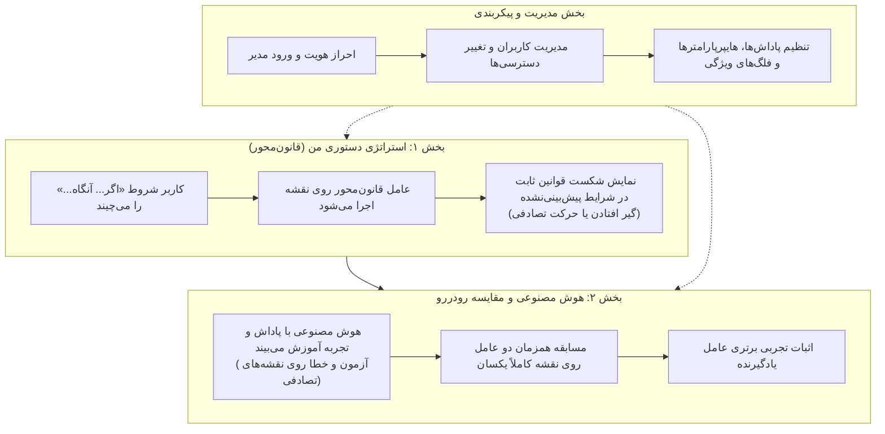

# 🎮 سامانه آموزشی هوش مصنوعی و یادگیری تقویتی (AI Game RL)

یک بستر تعاملی، مدرن و مقایسه‌ای مبتنی بر **یادگیری تقویتی (Reinforcement Learning - Q-Learning)** و **عامل‌های قانون‌محور (Rule-Based)** که با هدف آموزش شهودی، ملموس و جذاب مفاهیم هوش مصنوعی به کودکان، دانش‌آموزان و دانشجویان مهندسی شده است.

---

## 📑 فهرست مطالب
- [🎯 فلسفه و اهداف آموزشی](#-فلسفه-و-اهداف-آموزشی)
- [🗺️ عناصر، مکانیک‌ها و قوانین بازی](#️-عناصر-مکانیکها-و-قوانین-بازی)
- [👾 رفتار هوش مصنوعی هیولا و سیستم گیج‌شدن (Stun)](#-رفتار-هوش-مصنوعی-هیولا-و-سیستم-گیجشدن-stun)
- [⚖️ جدول جامع سیستم پاداش و جریمه](#️-جدول-جامع-سیستم-پاداش-و-جریمه)
- [🧠 بخش‌های اصلی سامانه](#-بخشهای-اصلی-سامانه)
  - [بخش ۱: استراتژی شرطی من (عامل قانون‌محور)](#بخش-۱-استراتژی-شرطی-من-عامل-قانونمحور)
  - [بخش ۲: آموزش هوش مصنوعی و مسابقه رو‌در‌رو](#بخش-۲-آموزش-هوش-مصنوعی-و-مسابقه-رودررو)
  - [بخش ۳: تئاتر ری‌پلی و بازرس تصمیم‌گیری (Decision Inspector)](#بخش-۳-تئاتر-ریپلی-و-بازرس-تصمیمگیری-decision-inspector)
  - [بخش ۴: مسابقه چندعاملی در آرنا (Multi-Agent Arena)](#بخش-۴-مسابقه-چندعاملی-در-آرنا-multi-agent-arena)
  - [بخش ۵: احراز هویت و پنل مدیریت پیشرفته (Admin Panel)](#بخش-۵-احراز-هویت-و-پنل-مدیریت-پیشرفته-admin-panel)
- [🔬 مدل ریاضی یادگیری تقویتی (Q-Learning)](#-مدل-ریاضی-یادگیری-تقویتی-q-learning)
- [🏗️ ساختار ماژولار و معماری پروژه](#️-ساختار-ماژولار-و-معماری-پروژه)
- [📡 مستندات کامل وب‌سرویس (REST API)](#-مستندات-کامل-وبسرویس-rest-api)
- [🚀 راهنمای نصب و راه‌اندازی گام‌به‌گام](#-راهنمای-نصب-و-راهاندازی-گامبهگام)
- [🧪 آزمون‌های خودکار و تضمین کیفیت (۴۳ آزمون)](#-آزمونهای-خودکار-و-تضمین-کیفیت-۴۳-آزمون)
- [📄 مجوز انتشار](#-مجوز-انتشار)

---

## 🎯 فلسفه و اهداف آموزشی

بزرگ‌ترین چالش در آموزش برنامه‌نویسی و هوش مصنوعی، درک تفاوت **برنامه‌نویسی سنتی (قانون‌محور)** با **هوش مصنوعی یادگیرنده (تجربه‌محور)** است:
* **در برنامه‌نویسی سنتی:** انسان باید تمام شروط ممکن («اگر هیولا آمد فلان کن، اگر سکه بود بهمان کن») را دستی بنویسد. کافیست یک وضعیت پیش‌بینی‌نشده رخ دهد تا ربات کاملاً فلج شود یا دست به حرکات تصادفی و غیرمنطقی بزند!
* **در یادگیری تقویتی (RL):** به ربات دستور نمی‌دهیم چه کاری انجام دهد؛ بلکه تنها یک «سیستم پاداش و جریمه» به او معرفی می‌کنیم. ربات خودش از طریق آزمون، خطا، آسیب دیدن و دریافت پاداش، مسیرهای هوشمندانه، جاخالی دادن و اولویت‌بندی منابع را کشف می‌کند.



### جدول مقایسه بنیادین دو عامل:
| معیار مقایسه | عامل اول: استراتژی دستوری انسان | عامل دوم: هوش مصنوعی یادگیرنده |
| :--- | :--- | :--- |
| **منبع تصمیم‌گیری** | فهرست شروط «اگر... آنگاه...» ایستا | جدول ارزش‌ها ($Q(s, a)$) برآمده از تجربه |
| **واکنش به حالات پیش‌بینی‌نشده** | گیج شدن و حرکت تصادفی | تعمیم بر اساس شباهت به تجارب قبلی |
| **انعطاف در برابر خطر** | پایین (نمی‌تواند همه حرکات هیولا را حدس بزند) | بسیار بالا (شناسایی بن‌بست‌ها و حفظ فاصله امن) |
| **قابلیت تکامل و پیشرفت** | ❌ ندارد (بدون تغییر دستی کد هیچ پیشرفتی نمی‌کند) | ✅ دارد (با هر تجربه و اپیزود بهینه‌تر می‌شود) |

---

## 🗺️ عناصر، مکانیک‌ها و قوانین بازی

بازی در یک نقشه شطرنجی دو‌بعدی (پیش‌فرض ۸ در ۸ با قابلیت تغییر ابعاد از ۵ تا ۱۶) برگزار می‌شود:

| عنصر | نماد | قوانین و سازوکار در بازی |
| :--- | :---: | :--- |
| **ربات بازیکن** | 🤖 | ایجنت اصلی که در بخش ۱ با قوانین شرطی و در بخش ۲ با مدل یادگیری تقویتی کنترل می‌شود. |
| **سکه** | 🪙 | منبع استاندارد امتیاز. ورود به خانه سکه موجب جمع‌آوری فوری آن می‌شود (+۱۰ پاداش). |
| **الماس** | 💎 | منبع باارزش و پرریسک. برای تبدیل شدن به سکه و امتیاز واقعی باید به مبدل برده شود (+۰.۵ پاداش کشف). |
| **مبدل الماس** | 🏪 | تبدیل‌کننده پیشرفته: **هر ۱ الماس ➔ ۲ سکه ارزشمند** (+۲۰ پاداش تبدیل). |
| **درب خروج** | 🚪 | دروازه رهایی. سکه‌ها فقط در صورتی حفظ و ثبت نهایی می‌شوند که ربات زنده از درب خارج شود (+۲۵ پاداش + پاداش امتیازی به ازای هر سکه). |
| **جان‌های ربات** | ❤️ | ۳ جان اولیه پیش‌فرض. با هر بار ضربه هیولا ۱ جان کسر می‌شود. اتمام جان‌ها مساوی با باخت کامل و سوختن تمام امتیازهاست. |
| **هیولا (ربات دشمن)** | 👾 | دشمن هوشمند با دید راداری که در صورت مشاهده بازیکن تعقیب می‌کند و در غیر این صورت گشت می‌زند. |

---

## 👾 رفتار هوش مصنوعی هیولا و سیستم گیج‌شدن (Stun)

هیولا یکی از ارکان جذابیت بازی و منبع ایجاد انگیزه بقاست:
1. **میدان دید راداری (Radar Threat Zone):** هیولا دارای شعاع دید ۳ خانه (فاصله منهتن) است که به صورت هاله قرمز متحرک در بوم رسم می‌شود.
2. **حالت تعقیب هوشمند (Chase Mode):** اگر بازیکن وارد شعاع دید شود، هیولا در هر گام کوتاه‌ترین خانه منتهی به بازیکن را انتخاب می‌کند.
3. **حالت گشت‌زنی رفت و برگشتی (Patrol Bounce):** در صورت نبود بازیکن، هیولا در راستای افقی/عمودی به صورت منظم گشت می‌زند و با برخورد به دیوار دور می‌زند.
4. **سیستم استاندارد گیج‌شدن و حذف پرش (Stun & Anti-Teleportation):**
   - **علت:** در نسخه‌های ابتدایی بازی، برای جلوگیری از گیر افتادن بازیکن در یک خانه و مرگ متوالی، هیولا به نقطه شروع نقشه پرتاب (تلپورت) می‌شد که باعث پرش ناگهانی آن در صفحه می‌گردید.
   - **راهکار پیاده‌سازی‌شده:** مکانیک تلپورت به طور کامل حذف شد. هنگام برخورد، هیولا به خانه قبلی خود (حداکثر ۱ خانه) پس می‌زند و برای **۲ گام کامل گیج (Stunned)** می‌شود (`stun_timer = 2`).
   - **جلوه بصری (Canvas VFX):** در زمان گیج بودن، چشمان هیولا به حالت ضربدری زرد `X X` درآمده و ستاره‌های چرخان `💫` بالای سرش معلق می‌شوند.
   - **آگاهی هوش مصنوعی:** در طول این ۲ گام، هیولا هیچ حرکتی نکرده و آسیبی وارد نمی‌کند؛ وضعیت محیطی `enemy_threat` برای هوش مصنوعی به حالت `STUNNED` درمی‌آید تا ایجنت متوجه فرصت فرار یا جمع‌آوری امن منابع شود.

---

## ⚖️ جدول جامع سیستم پاداش و جریمه

سیستم پاداش (Reward Function) زبان هدایتگر هوش مصنوعی است. تمام این مقادیر از پنل مدیریت قابل ویرایش هستند:

| رویداد در محیط | مقدار پیش‌فرض | هدف آموزشی و فلسفه رفتاری |
| :--- | :---: | :--- |
| **جمع‌آوری سکه** | `+10.0` | تشویق ربات به جاروب کردن منابع اصلی محیط |
| **تبدیل الماس در مبدل** | `+20.0` | ایجاد انگیزه قوی برای طی کردن مسیر ترکیبی (الماس ➔ مبدل) |
| **برداشتن الماس خام** | `+0.5` | پاداش جزئی برای کشف، بدون ایجاد انحراف پیش از تبدیل |
| **خروج موفق از درب** | `+25.0` | اولویت اصلی؛ ربات یاد می‌گیرد جمع‌آوری منابع بدون خروج بی‌فایده است |
| **پاداش خروج به ازای هر سکه** | `+5.0` | ترغیب ربات به حفظ سکه‌ها و سوار کردن آن‌ها در سفینه خروج |
| **هر گام حرکت عادی** | `-0.05` | جریمه ملایم اتلاف وقت برای یافتن کوتاه‌ترین و بهینه‌ترین مسیر |
| **برخورد با دیوار یا حاشیه** | `-1.0` | یادگیری سریع مرزهای فیزیکی نقشه و عدم کوبیدن به دیوار |
| **ضربه خوردن از هیولا** | `-10.0` | ایجاد حس خطر و انگیزه برای دوری از هیولا و فرار |
| **مرگ کامل (اتمام جان‌ها)** | `-25.0` | سنگین‌ترین جریمه محیط؛ تضمین اینکه بقا در اولویت مطلق است |

---

## 🧠 بخش‌های اصلی سامانه

### بخش ۱: استراتژی شرطی من (عامل قانون‌محور)
در این بخش، دانش‌آموز با استفاده از رابط بصری بلوکی شروط را می‌چیند:
* **چیدمان ترتیبی شروط:** اولویت شروط از بالا به پایین است؛ اولین شرطی که در نقشه محقق شود اجرا خواهد شد.
* **شروط ترکیبی و آستانه فاصله:**
  - اگر هیولا در خانه مجاور است ➔ جاخالی تاکتیکی
  - اگر فاصله تا هیولا کمتر از ۲ است و فقط ۱ جان داری ➔ فرار به سمت در خروج
  - اگر الماس داری ➔ رفتن به مبدل
  - اگر سکه در نقشه هست ➔ رفتن به نزدیک‌ترین سکه
  - اگر تمام سکه‌ها جمع شده‌اند ➔ رفتن به در خروج
* **فلگ ادمین الگوهای آماده (`show_presets`):**
  - دکمه‌های الگوهای آماده («شکارچی سکه»، «محتاط و هوشیار»، «عاشق الماس») تحت کنترل فلگ مدیریتی قرار دارند.
  - اگر مدیر این فلگ را خاموش کند، بخش الگوها برای کاربران عادی کاملاً مخفی می‌شود تا دانش‌آموز خودش از صفر شروط را بسازد.
* **قانون پیش‌فرض حرکت تصادفی:** اگر وضعیت نقشه با هیچ‌یک از شروط منطبق نباشد، ربات گیج شده و تصادفی حرکت می‌کند!
* **نقد آموزشی زنده:** پس از شبیه‌سازی، سیستم تحلیلی به زبان فارسی دلایل موفقیت یا شکست استراتژی کاربر را گوشزد می‌کند.

---

### بخش ۲: آموزش هوش مصنوعی و مسابقه رو‌در‌رو
* **تنظیم تعداد اپیزودهای آموزش:** امکان انتخاب سریع آموزش در بازه‌های **۵، ۱۰، ۲۰ و ۴۰ اپیزود** (یا مقدار سفارشی از فایل کانفیگ).
* **نمودارهای زنده و پویای یادگیری:**
  - نمودار روند افزایش پاداش تجمعی در طول اپیزودها.
  - نمودار روند نجات سکه‌ها و نرخ بقا.
* **میدان مسابقه همزمان روی نقشه کاملاً یکسان:**
  - دو بوم نقشه کنار هم قرار می‌گیرند.
  - بوم سمت راست: استراتژی قانون‌محور کاربر.
  - بوم سمت چپ: هوش مصنوعی یادگیرنده.
  - هر دو عامل روی یک بذر تصادفی مشترک با موقعیت مکانی و موانع کاملاً برابر به رقابت می‌پردازند.
* **کالبدشکافی هوشمند مسابقه:** موتور تحلیلی پس از پایان، علت برتری هوش مصنوعی (مثل حفظ فاصله ایمن، اولویت‌بندی پویا یا فرار از محاصره) را به صورت متنی و شیوا توضیح می‌دهد.

---

### بخش ۳: تئاتر ری‌پلی و بازرس تصمیم‌گیری (Decision Inspector)
ابزاری فوق‌العاده برای درک دقیق مغز هوش مصنوعی در هر لحظه از زمان:
* **نوار لغزنده گام‌به‌گام (Step Scrubber):** امکان مرور فریم‌به‌فریم تمام اپیزودها و بازگشت به عقب.
* **جدول مقایسه‌ای ارزش‌ها ($Q$-Values Side-by-Side):**
  - ستون ارزش‌های پیشین (پیش‌فرض استراتژی اولیه).
  - ستون ارزش‌های آموخته‌شده با تجربه (آزمون و خطا).
* **برچسب کاوش در برابر بهره‌برداری:** مشخص می‌کند آیا حرکت به دلیل کاوش تصادفی ($\epsilon$-greedy) بوده یا به خاطر بالاترین ارزش آموخته‌شده.
* **توضیحات فارسی به ازای هر گام:** توضیح می‌دهد که چرا عامل در این لحظه مثلاً چرخش به راست را به بالا ترجیح داده است.

---

### بخش ۴: مسابقه چندعاملی در آرنا (Multi-Agent Arena)
* شبیه‌سازی رقابت همزمان **۴ ربات مختلف** در یک میدان بزرگ‌تر (۱۰ در ۱۰):
  1. ربات شما (مدل آموزش‌دیده یا استراتژی شما)
  2. ربات شکارچی سکه (تمرکز صرف بر سکه‌ها)
  3. ربات محتاط و هوشیار (اولویت دوری از هیولا)
  4. ربات عاشق الماس (ریسک‌پذیر در جمع‌آوری الماس و مبدل)
* **منابع اشتراکی:** سکه‌ها و الماس‌ها مشترک هستند؛ هر کس زودتر برسد صاحب امتیاز می‌شود!
* **جدول نهایی رده‌بندی (Leaderboard):** معرفی برنده نهایی، تعداد سکه‌های خارج‌شده و وضعیت سلامت رقبا.

---

### بخش ۵: احراز هویت و پنل مدیریت پیشرفته (Admin Panel)
* **سامانه امن احراز هویت مبتنی بر توکن Bearer:**
  - مدیر پیش‌فرض: `admin` با رمز عبور `admin123`
  - کاربر پیش‌فرض: `student` با رمز عبور `123456`
* **کنترل دسترسی نقش‌محور (RBAC):** امکان ایجاد کاربر جدید، ارتقا یا تنزیل دسترسی به مدیر/کاربر، و حذف کاربران.
* **پیکربندی پارامترهای بازی و هوش مصنوعی:**
  - ابعاد نقشه، تعداد سکه و الماس، جان‌ها و حداکثر گام مجاز.
  - سیستم مقادیر پاداش و جریمه‌ها.
  - هایپرپارامترهای Q-Learning ($lpha$, $\gamma$, $\epsilon_{	ext{init}}$, $\epsilon_{	ext{min}}$, Decay).
* **فلگ‌های ویژگی (Feature Flags):**
  - کلید روشن/خاموش نمایش الگوهای آماده استراتژی برای کاربران عادی.
* **ذخیره‌سازی دوگانه پایدار:** ذخیره همزمان در پایگاه داده SQLite و فایل استاندارد `config.json`.

---

## 🔬 مدل ریاضی یادگیری تقویتی (Q-Learning)

هوش مصنوعی بازی از الگوریتم استاندارد **Q-Learning گسسته با شکل‌دهی پاداش (Reward Shaping)** بهره می‌برد:

### ۱. فرمول به‌روزرسانی بلمن (Bellman Update Equation)
$$Q(s, a) \leftarrow Q(s, a) + lpha \left[ r + \gamma \max_{a'} Q(s', a') - Q(s, a) 
ight]$$

که در آن:
* $s$: وضعیت فعلی محیط
* $a$: عمل انتخاب‌شده (بالا، پایین، چپ، راست)
* $r$: پاداش لحظه‌ای دریافتی
* $s'$: وضعیت بعدی محیط پس از اجرای عمل
* $lpha$: نرخ یادگیری (Learning Rate، پیش‌فرض ۰.۲)
* $\gamma$: ضریب تخفیف پاداش‌های آینده (Discount Factor، پیش‌فرض ۰.۹)

### ۲. استراتژی کاوش و بهره‌برداری ($\epsilon$-Greedy)
در هر مرحله، عمل با احتمال $\epsilon$ تصادفی انتخاب می‌شود و با احتمال $1-\epsilon$ بهترین عمل با بیشترین ارزش انتخاب می‌گردد:
$$a = egin{cases} 	ext{عمل تصادفی (کاوش)} & 	ext{با احتمال } \epsilon \ rg\max_{a} Q(s, a) & 	ext{با احتمال } 1 - \epsilon \end{cases}$$
میزان $\epsilon$ با ضرب در نرخ کاهش ($	ext{Decay} = 0.96$) پس از هر اپیزود کاهش می‌یابد تا عامل از فاز یادگیری به فاز مهارت برسد.

### ۳. فضای وضعیت نسبی تعمیم‌پذیر (Relative Feature Representation)
برای اینکه هوش مصنوعی بتواند دانشی که در یک نقشه آموخته را فوراً در نقشه‌های کاملاً جدید و تصادفی به کار گیرد، وضعیت به صورت ویژگی‌های نسبی کدگذاری می‌شود:
$$	ext{State} = ig( 	ext{dir}(	ext{coin}), 	ext{dir}(	ext{diamond}), 	ext{dir}(	ext{converter}), 	ext{dir}(	ext{exit}), 	ext{threat}(	ext{enemy}), 	ext{has\_diamond}, 	ext{coins\_status}, 	ext{low\_lives} ig)$$
ویژگی $	ext{threat}(	ext{enemy})$ شامل وضعیت‌های `SAFE`، `WARN`، `DANGER`، `ADJACENT` و **`STUNNED`** (هنگام گیج بودن دشمن) است.

---

## 🏗️ ساختار ماژولار و معماری پروژه

```text
ai-game-rl/
├── game/
│   ├── config.py                 # مدل داده پیکربندی، ذخیره پایدار در دیتابیس و config.json
│   ├── auth/
│   │   ├── auth.py               # احراز هویت، اعتبارسنجی رمزهای عبور و صدور توکن‌ها
│   │   └── dependencies.py       # وابستگی‌های دسترسی FastAPI (get_current_user, require_admin)
│   ├── database/
│   │   └── db.py                 # پایگاه داده SQLite، جداول کاربران، نشست‌ها و تنظیمات
│   ├── environment/
│   │   ├── entities.py           # موقعیت مکانی (Position)، اعمال (Action) و وضعیت ربات
│   │   ├── enemy.py              # هوش مصنوعی هیولا، رادار، گشت‌زنی و سیستم گیج‌شدن (Stun)
│   │   ├── grid.py               # مولد نقشه‌های تصادفی، چینش موانع، منابع و خروج
│   │   ├── rules.py              # قوانین محیط بازی، فیزیک برخوردها و جریمه‌ها
│   │   └── state.py              # بازنمایی بردار وضعیت نسبی و تعمیم‌پذیر
│   ├── strategy/
│   │   ├── rule.py               # ساختار استراتژی و شروط اگر... آنگاه...
│   │   ├── rule_based_agent.py   # عامل قانون‌محور و ارزیاب اولویت شروط
│   │   └── strategy_builder.py   # الگوهای آماده اولیه و سازنده بلوک‌ها
│   ├── rl/
│   │   └── q_learning.py         # هسته یادگیری تقویتی Q-Learning و شکل‌دهی پاداش
│   ├── training/
│   │   ├── trainer.py            # چرخه آموزش اپیزودها، ثبت پیشرفت و بازآموزی
│   │   ├── episode.py            # اجرای یک اپیزود کامل و ثبت رویدادها
│   │   └── comparison.py         # موتور مقایسه رو‌در‌روی دو عامل در نقشه یکسان
│   ├── replay/
│   │   └── replay.py             # داده‌های فریم‌به‌فریم ری‌پلی و موتور تحلیل تصمیمات
│   ├── competition/
│   │   └── arena.py              # موتور شبیه‌ساز آرنا و مسابقه همزمان ۴ عامل
│   └── ui/
│       ├── app.py                # وب‌سرور FastAPI و اندپوینت‌های REST API
│       ├── templates/
│       │   └── index.html        # واسط کاربری تک‌صفحه‌ای واکنش‌گرا (RTL)
│       └── static/
│           ├── css/style.css     # استایل‌های مدرن با پالت رنگی استاندارد
│           └── js/
│               ├── api.js        # کلاینت ارتباطی ناهمگام با سرور
│               ├── auth.js       # مدیریت ورود، خروج و وضعیت نشست در کلاینت
│               ├── admin.js      # کنترل پنل تنظیمات و مدیریت کاربران
│               ├── canvas.js     # رندرر بهینه بوم HTML5 (ربات‌ها، هیولا، سکه‌ها)
│               ├── strategy.js   # سازنده بلوک‌های شرطی و فلگ الگوهای آماده
│               ├── training.js   # نمودارهای پیشرفت و کنترل فرآیند آموزش
│               ├── comparison.js # کنترل مسابقه دوگانه و مقایسه همزمان
│               ├── replay.js     # کنترل پخش مجدد و بازرس تصمیمات
│               └── arena.js      # کنترل مسابقه چندعاملی در آرنا
├── tests/                        # ۴۳ آزمون واحد خودکار جامع
│   ├── test_environment.py       # آزمون فیزیک محیط، هیولا، جمع‌آوری سکه و گیج‌شدن
│   ├── test_strategy.py          # آزمون شروط اگر... آنگاه... و اولویت‌بندی
│   ├── test_rule_based_agent.py  # آزمون رفتار عامل قانون‌محور در سناریوهای مختلف
│   ├── test_rl.py                # آزمون هسته یادگیری تقویتی و کاهش اپسیلون
│   ├── test_comparison.py        # آزمون مسابقه دوگانه روی بذر یکسان
│   ├── test_api.py               # آزمون اندپوینت‌های وب‌سرویس و پاسخ‌های JSON
│   ├── test_auth_admin.py        # آزمون نشست‌ها، اختیارات ادمین و ذخیره کانفیگ
│   └── test_arena.py             # آزمون شبیه‌سازی مسابقه چندعاملی
├── config.json                   # فایل پیکربندی پایدار تنظیمات سیستم
├── run_server.py                 # اسکریپت اجرای وب‌سرور گرافیکی
├── run_cli.py                    # اسکریپت اجرای حالت متنی کنسول
└── README.md                     # مستندات جامع پروژه
```

---

## 📡 مستندات کامل وب‌سرویس (REST API)

| متد | مسیر وب‌سرویس | شرح عملکرد | سطح دسترسی |
| :---: | :--- | :--- | :---: |
| `GET` | `/` | دریافت رابط کاربری وب (HTML/JS/CSS) | عمومی |
| `GET` | `/api/config` | دریافت تنظیمات و پارامترهای فعال سامانه | عمومی |
| `GET` | `/api/presets` | دریافت فهرست الگوهای آماده استراتژی | عمومی |
| `POST` | `/api/auth/login` | ورود کاربر با نام کاربری و رمز عبور | عمومی |
| `POST` | `/api/auth/logout` | ابطال نشست و خروج از حساب | عمومی |
| `GET` | `/api/auth/me` | دریافت وضعیت و اطلاعات کاربر جاری | عمومی |
| `POST` | `/api/strategy/test` | اجرای زنده استراتژی شرطی روی نقشه | عمومی |
| `POST` | `/api/comparison/dual` | مسابقه همزمان استراتژی با هوش مصنوعی در نقشه یکسان | عمومی |
| `POST` | `/api/train` | آموزش کامل هوش مصنوعی با تعداد اپیزود دلخواه | عمومی |
| `POST` | `/api/train/reset` | بازنشانی حافظه و تجربیات هوش مصنوعی | عمومی |
| `POST` | `/api/retrain` | بازآموزی سریع هوش مصنوعی با استراتژی جدید | عمومی |
| `GET` | `/api/replay/{id}` | دریافت فریم‌ها و لاگ تصمیمات یک اپیزود ری‌پلی | عمومی |
| `POST` | `/api/competition` | اجرای مسابقه ۴ ربات در آرنا | عمومی |
| `GET` | `/api/admin/users` | دریافت فهرست کامل کاربران سیستم | مدیر (Admin) |
| `POST` | `/api/admin/users` | ایجاد حساب کاربری جدید | مدیر (Admin) |
| `PUT` | `/api/admin/users/{id}/role` | تغییر سطح دسترسی کاربر (مدیر / دانش‌آموز) | مدیر (Admin) |
| `DELETE` | `/api/admin/users/{id}` | حذف حساب کاربری | مدیر (Admin) |
| `GET` | `/api/admin/config` | دریافت تنظیمات پیشرفته در پنل مدیریت | مدیر (Admin) |
| `POST` | `/api/admin/config` | ذخیره پایدار پارامترها و فلگ‌های ویژگی | مدیر (Admin) |
| `POST` | `/api/admin/config/reset` | بازنشانی تنظیمات به پیش‌فرض کارخانه | مدیر (Admin) |

> **نکته امنیتی:** برای دسترسی به مسیرهای مدیر، توکن دریافتی از مسیر `/api/auth/login` باید در سرآیند `Authorization: Bearer <token>` ارسال گردد.

---

## 🚀 راهنمای نصب و راه‌اندازی گام‌به‌گام

### پیش‌نیازها
- پایتون ۳.۱۰ یا بالاتر نصب شده باشد.
- مرورگر وب استاندارد (Chrome, Firefox, Edge, Safari).

### ۱. کلون کردن مخزن:
```bash
git clone https://github.com/Sorooshsatary/ai-game-rl.git
cd ai-game-rl
```

### ۲. ایجاد و فعال‌سازی محیط مجازی:
در ویندوز (PowerShell):
```powershell
python -m venv .venv
.\.venv\Scripts\Activate.ps1
```
در لینوکس / مک:
```bash
python3 -m venv .venv
source .venv/bin/activate
```

### ۳. نصب وابستگی‌ها:
```bash
pip install -r requirements.txt
```
*(نیازمندی‌ها شامل `fastapi`, `uvicorn`, `pydantic` می‌باشد).*

### ۴. اجرای وب‌سرور:
```bash
python run_server.py
```
برنامه بلافاصله اجرا شده و در آدرس زیر در دسترس است:
👉 **`http://localhost:8000`**

### ۵. اجرای سریع و بدون دردسر با داکر (Docker & Docker Compose)

در صورت تمایل به اجرای کانتینری و ایزوله بدون نیاز به نصب پایتون بر روی سیستم میزبان:

**روش اول: اجرا با Docker Compose (پیشنهادی):**
```bash
docker compose up -d
```

**روش دوم: ساخت و اجرای مستقیم ایمیج داکر:**
```bash
# ساخت ایمیج سبک پایتون
docker build -t ai-game-rl .

# اجرای کانتینر روی پورت ۸۰۰۰
docker run -d -p 8000:8000 --name ai-game-rl-server ai-game-rl
```
پس از بالا آمدن کانتینر، بازی بلافاصله در آدرس **`http://localhost:8000`** در دسترس است.
جهت مشاهده لاگ‌ها یا متوقف کردن کانتینر:
```bash
# مشاهده لاگ سرور
docker compose logs -f

# توقف و پاکسازی کانتینر
docker compose down
```

### ورود با حساب مدیر:
- **نام کاربری:** `admin`
- **رمز عبور:** `admin123`

---

## 🧪 آزمون‌های خودکار و تضمین کیفیت (۴۸ آزمون)

پروژه دارای یک سوییت آزمون کامل با **۴۸ تست واحد خودکار** است که تمامی اجزا اعم از فیزیک نقشه، مکانیک‌های هیولا و گیج‌شدن، الگوریتم Q-Learning، ادراک جهت‌ها و پیش‌بینی مسیر، احراز هویت، فلگ‌های ادمین و وب‌سرویس‌ها را به طور دقیق بررسی می‌کنند:

```powershell
python -m unittest discover -s tests -p "test_*.py"
```

خروجی آزمون‌ها:
```text
................................................
----------------------------------------------------------------------
Ran 48 tests in 1.640s

OK
```

---

## 📄 مجوز انتشار
این پروژه برای اهداف آموزشی، پژوهشی و ترویج علم برنامه‌نویسی و هوش مصنوعی تحت مجوز آزاد **MIT License** منتشر شده است.
