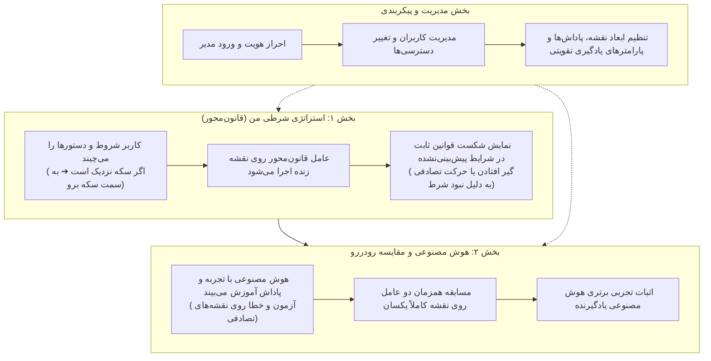

# 🎮 بازی آموزشی هوش مصنوعی و یادگیری تقویتی

یک بستر تعاملی، آموزشی و مقایسه‌ای مبتنی بر **یادگیری تقویتی** و **عامل‌های قانون‌محور** که به گونه‌ای مهندسی شده تا کودکان، دانش‌آموزان و علاقه‌مندان بتوانند مفهوم هوش مصنوعی، محدودیت قوانین ثابت برنامه‌نویسی و قدرت تصمیم‌گیری مبتنی بر تجربه و پاداش را به صورت ملموس، عملی و رو‌در‌رو بیاموزند.

---

## 📑 فهرست مطالب
- [🎯 هدف آموزشی و ساختار برنامه](#-هدف-آموزشی-و-ساختار-برنامه)
- [🗺️ عناصر، موجودیت‌ها و مکانیک‌های بازی](#️-عناصر-موجودیتها-و-مکانیکهای-بازی)
- [⚖️ جدول جامع سیستم پاداش و جریمه](#️-جدول-جامع-سیستم-پاداش-و-جریمه)
- [👾 رفتار هوش مصنوعی هیولا](#-رفتار-هوش-مصنوعی-هیولا)
- [🧠 بخش‌های اصلی سامانه](#-بخشهای-اصلی-سامانه)
  - [بخش ۱: استراتژی شرطی من (قانون‌محور)](#بخش-۱-استراتژی-شرطی-من-قانونمحور)
  - [بخش ۲: هوش مصنوعی و مقایسه رو‌در‌رو (یادگیری تقویتی)](#بخش-۲-هوش-مصنوعی-و-مقایسه-رودررو-یادگیری-تقویتی)
  - [بخش ۳: احراز هویت و پنل مدیریت پارامترها](#بخش-۳-احراز-هویت-و-پنل-مدیریت-پارامترها)
- [🏗️ ساختار ماژولار و فایل‌های پروژه](#️-ساختار-ماژولار-و-فایلهای-پروژه)
- [📡 مستندات وب‌سرویس و ارتباط کلاینت-سرور](#-مستندات-وبسرویس-و-ارتباط-کلاینت-سرور)
- [🚀 راهنمای نصب و راه‌اندازی گام‌به‌گام](#-راهنمای-نصب-و-راهاندازی-گامبهگام)
- [🧪 آزمون‌های خودکار و تضمین کیفیت](#-آزمونهای-خودکار-و-تضمین-کیفیت)

---

## 🎯 هدف آموزشی و ساختار برنامه

برای آنکه یادگیرنده ضرورت و برتری یادگیری تقویتی را با تمام وجود درک کند، برنامه دقیقاً به **دو بخش مستقل و هماهنگ** به همراه **پنل مدیریت سامانه** تفکیک شده است:



### جدول مقایسه بنیادین دو عامل:
| ویژگی | عامل اول: استراتژی شرطی انسان | عامل دوم: هوش مصنوعی یادگیرنده |
| :--- | :--- | :--- |
| **منشأ تصمیم‌گیری** | فهرست شروط «اگر... آنگاه...» تنظیم‌شده توسط کاربر | ارزش‌های ریاضی پاداش که با آزمون و خطا آموخته است |
| **واکنش به حالت‌های تعریف‌نشده** | گیج شدن و انجام حرکت تصادفی | ارزیابی گزینه‌ها بر اساس شباهت و تجارب گذشته |
| **انعطاف‌پذیری در برابر خطر** | پایین (نمی‌تواند تمام موقعیت‌های پیچیده را از قبل پیش‌بینی کند) | بسیار بالا (به صورت خودکار از محاصره توسط هیولا دوری می‌کند) |
| **قابلیت یادگیری و اصلاح** | ❌ ندارد (همواره در وضعیت‌های مشابه کار ثابتی انجام می‌دهد) | ✅ دارد (با هر بار آسیب دیدن، ارزش آن عمل کاهش می‌یابد) |

---

## 🗺️ عناصر، موجودیت‌ها و مکانیک‌های بازی

بازی در یک نقشه شطرنجی قابل پیکربندی برگزار می‌شود (پیش‌فرض ۸ در ۸):

| عنصر | نماد | عملکرد و قوانین بازی |
| :--- | :---: | :--- |
| **عامل بازیکن** | 🤖 | ربات بازی که در بخش اول با شروط شما و در بخش دوم با هوش مصنوعی حرکت می‌کند. |
| **سکه** | 🪙 | منبع اصلی امتیاز. با وارد شدن عامل جمع‌آوری می‌شود (+۱۰ پاداش پیش‌فرض). |
| **الماس** | 💎 | منبع پرریسک و با ارزش بالا. برای تبدیل به امتیاز باید به مبدل برسد (+۰.۵ پاداش اولیه). |
| **مبدل الماس** | 🏪 | الماس‌ها را تبدیل می‌کند: **هر ۱ الماس ➔ ۲ سکه ارزشمند** (+۲۰ پاداش پیش‌فرض). |
| **درب خروج** | 🚪 | دروازه نجات. سکه‌ها فقط در صورتی ذخیره می‌شوند که عامل زنده از این در خارج شود (+۵ پاداش). |
| **جان عامل** | ❤️ | ۳ جان اولیه پیش‌فرض. هر برخورد با هیولا ۱ جان کم می‌کند (-۱۵ پاداش). با اتمام جان‌ها بازی می‌سوزد (-۵۰ پاداش). |
| **هیولا** | 👾 | دشمن متحرک. اگر عامل نزدیک باشد تعقیب می‌کند؛ در غیر این صورت گشت می‌زند. |

---

## ⚖️ جدول جامع سیستم پاداش و جریمه

پاداش‌ها انگیزه عامل هوش مصنوعی را برای یادگیری رفتار درست شکل می‌دهند (قابل ویرایش در پنل مدیریت):

| رویداد در بازی | مقدار پیش‌فرض | دلیل آموزشی و جهت‌دهی رفتار |
| :--- | :---: | :--- |
| **جمع‌آوری سکه** | `+10.0` | تشویق به جمع‌آوری سریع منابع اصلی |
| **تبدیل الماس در مبدل** | `+20.0` | انگیزه بسیار بالا برای پیمودن مسیر به سمت مبدل |
| **برداشتن الماس خام** | `+0.5` | کشف اشیا بدون اعطای امتیاز نهایی پیش از تبدیل |
| **خروج موفقیت‌آمیز از در** | `+5.0` | ترغیب به اتمام مرحله و نجات سکه‌های جمع‌شده |
| **هر گام حرکت عادی** | `-0.1` | جریمه اتلاف وقت برای یافتن کوتاه‌ترین مسیر |
| **برخورد به دیوار یا لبه نقشه** | `-1.0` | یادگیری اجتناب از حرکات نامعتبر |
| **برخورد با هیولا (کسر جان)** | `-15.0` | ایجاد ترس و انگیزه برای دوری از هیولا |
| **مرگ کامل (صفر شدن جان‌ها)** | `-50.0` | سخت‌ترین جریمه؛ ربات یاد می‌گیرد بقا بالاتر از هر چیز است |

---

## 👾 رفتار هوش مصنوعی هیولا

هیولا به دو شکل رفتار می‌کند:
1. **حالت تعقیب:** اگر فاصله منهتن تا عامل ۳ خانه یا کمتر باشد، کوتاه‌ترین مسیر برای حمله به عامل را انتخاب می‌کند.
2. **حالت گشت‌زنی:** اگر عامل دور باشد، هیولا در مسیرهای مشخص به صورت رفت و برگشتی گشت می‌زند.

---

## 🧠 بخش‌های اصلی سامانه

### بخش ۱: استراتژی شرطی من (قانون‌محور)
در این بخش، کاربر مانند یک برنامه‌نویس، زنجیره‌ای از قوانین شرطی **«اگر... آنگاه...»** می‌چیند:
* **انتخاب الگوهای آماده:** متوازن و هوشمند، شکارچی سکه، عاشق الماس، محتاط و هوشیار، ماجراجوی نترس.
* **سازنده شروط بلوکی:**
  * اگر [سکه نزدیک یا در دسترس است] ➔ آنگاه [به سمت سکه برو]
  * اگر [دشمن داشت به سمتت می‌آمد (فاصله ۲ یا کمتر)] ➔ آنگاه [از دست هیولا فرار کن]
  * اگر [الماس در کوله‌پشتی داری] ➔ آنگاه [به سمت تبدیل‌کننده برو]
  * اگر [فقط ۱ جان برایت باقی مانده] ➔ آنگاه [به سمت در خروج برو]
  * اگر [تمام سکه‌های نقشه جمع شده‌اند] ➔ آنگاه [به سمت در خروج برو]
* **قانون پیش‌فرض حرکت تصادفی:** اگر برای وضعیت فعلی نقشه هیچ شرطی تعریف نشده باشد، ربات گیج شده و یک **حرکت کاملاً تصادفی** انجام می‌دهد!
* **نقشه زنده و همیشه‌پیدا:** نقشه شبیه‌سازی در کنار پنل شروط همواره باز است و با زدن دکمه «اجرای استراتژی» یا «نقشه جدید»، رفتار ربات و نقد آموزشی عملکرد آن به تصویر کشیده می‌شود.

### بخش ۲: هوش مصنوعی و مقایسه رو‌در‌رو (یادگیری تقویتی)
در این بخش، کاربر شاهد شکوفایی هوش مصنوعی است:
* **مرکز آموزش هوش مصنوعی:**
  * دکمه آموزش کامل (۳۰ مرحله) و بازآموزی سریع (۱۵ مرحله).
  * کارت‌های شاخص عملکرد: نرخ موفقیت خروج، میانگین پاداش، میزان اصلاح تصمیمات با تجربه.
  * دو نمودار زنده: روند افزایش پاداش کل و روند افزایش سکه‌های موفق.
* **میدان مسابقه رو‌در‌رو روی نقشه یکسان:**
  * دو بوم نقشه کنار هم در یک نقشه کاملاً یکسان با منابع مشترک.
  * بوم راست: عامل اول (استراتژی شرطی شما).
  * بوم چپ: عامل دوم (هوش مصنوعی یادگیرنده).
  * گزارش گام‌به‌گام و تصمیمات هر عامل به زبان فارسی.
  * کالبدشکافی آموزشی برنده مسابقه و جدول جامع مقایسه دستاوردها.

### بخش ۳: احراز هویت و پنل مدیریت پارامترها
* **سیستم ورود و نشست امن:** کاربران می‌توانند وارد حساب خود شوند؛ حساب‌های دارای نقش مدیر به تب **«⚙️ پنل مدیریت»** دسترسی دارند.
  * مدیر پیش‌فرض: `admin` با رمز عبور `admin123`
  * کاربر پیش‌فرض: `student` با رمز عبور `123456`
* **مدیریت کاربران و نقش‌ها:** امکان ثبت کاربر جدید، تغییر سطح دسترسی (مدیر / دانش‌آموز)، و حذف کاربر.
* **پیکربندی پارامترهای بازی:** ویرایش ابعاد نقشه، تعداد سکه و الماس، جان اولیه، حداکثر گام‌ها، مقادیر پاداش‌ها و جریمه‌ها، و نرخ‌های یادگیری تقویتی و ذخیره‌سازی پایدار آن‌ها در پایگاه داده SQLite.

---

## 🏗️ ساختار ماژولار و فایل‌های پروژه

```text
ai-game-rl/
├── game/
│   ├── config.py                 # تنظیمات ابعاد نقشه، پاداش‌ها، هایپرپارامترها و ذخیره‌سازی پویا
│   ├── database/                 # مدیریت پایگاه داده SQLite، کاربران، نشست‌ها و تنظیمات
│   ├── auth/                     # احراز هویت، کنترل سطوح دسترسی (RBAC) و محافظت مسیرها
│   ├── environment/              # شبیه‌ساز نقشه، موقعیت‌ها، هیولا و قواعد بازی
│   ├── rl/                       # جدول ارزش‌ها، کاوش تصادفی و یادگیری تقویتی
│   ├── strategy/                 # عامل قانون‌محور و پردازش شروط اگر... آنگاه...
│   ├── training/                 # فرآیند آموزش و موتور مقایسه رو‌در‌رو
│   └── ui/                       # رابط کاربری وب (FastAPI، بوم نقشه، اسکریپت‌ها و استایل‌ها)
├── tests/                        # ۳۰ آزمون خودکار صحت‌سنجی عملکرد
├── run_server.py                 # اسکریپت اجرای وب‌سرور برنامه
├── run_cli.py                    # اجرای شبیه‌ساز متنی در خط فرمان
└── README.md                     # مستندات کامل پروژه
```

---

## 📡 مستندات وب‌سرویس و ارتباط کلاینت-سرور

| روش | آدرس وب‌سرویس | شرح کاربرد | سطح دسترسی |
| :---: | :--- | :--- | :---: |
| `GET` | `/` | نمایش رابط کاربری وب | عمومی |
| `POST` | `/api/auth/login` | ورود کاربر و دریافت توکن نشست | عمومی |
| `POST` | `/api/auth/logout` | خروج از حساب کاربری | عمومی |
| `GET` | `/api/auth/me` | دریافت اطلاعات کاربر جاری | عمومی |
| `GET` | `/api/presets` | دریافت الگوهای آماده استراتژی شرطی | عمومی |
| `POST` | `/api/strategy/test` | اجرای زنده استراتژی شرطی روی نقشه | عمومی |
| `POST` | `/api/comparison/dual` | مسابقه همزمان استراتژی قانون‌محور با هوش مصنوعی | عمومی |
| `POST` | `/api/train` | آموزش هوش مصنوعی با پاداش و تجربه | عمومی |
| `POST` | `/api/retrain` | بازآموزی سریع هوش مصنوعی | عمومی |
| `GET` | `/api/admin/users` | دریافت فهرست تمام کاربران | مدیر |
| `POST` | `/api/admin/users` | ایجاد کاربر جدید با نقش مشخص | مدیر |
| `PUT` | `/api/admin/users/{id}/role` | تغییر سطح دسترسی کاربر | مدیر |
| `DELETE` | `/api/admin/users/{id}` | حذف کاربر | مدیر |
| `GET` | `/api/admin/config` | دریافت تنظیمات پارامترهای فعال | مدیر |
| `POST` | `/api/admin/config` | ذخیره‌سازی پایدار پارامترهای جدید | مدیر |
| `POST` | `/api/admin/config/reset` | بازنشانی پارامترها به مقادیر اولیه کارخانه | مدیر |

---

## 🚀 راهنمای نصب و راه‌اندازی گام‌به‌گام

### پیش‌نیازها
- پایتون نسخه ۳.۱۰ یا بالاتر
- یک مرورگر وب مدرن

### مراحل اجرا:
```powershell
# ۱. فعال‌سازی محیط مجازی
.\.venv\Scripts\Activate.ps1

# ۲. اجرای وب‌سرور گرافیکی
python run_server.py
```
سپس در مرورگر به آدرس زیر مراجعه کنید:
**`http://localhost:8000`**

---

## 🧪 آزمون‌های خودکار و تضمین کیفیت

تمامی بخش‌های پروژه تحت پوشش **۳۰ آزمون خودکار** قرار دارند:

```powershell
python -m unittest discover -s tests -p "test_*.py"
```
```text
Ran 30 tests in 0.786s
OK
```

---

## 📄 مجوز انتشار
این پروژه جهت استفاده‌های آموزشی و پژوهشی تحت مجوز آزاد MIT منتشر شده است.
